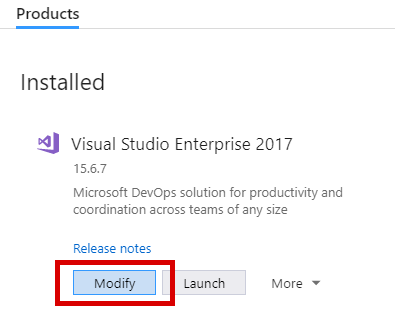
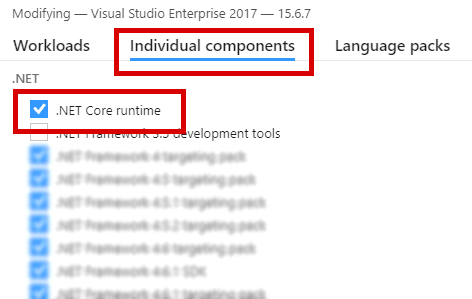
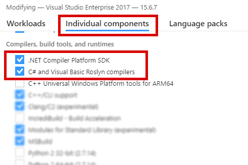

# Usage
[go back](../readme.md)

This article is divided into the following sections:

 1) [How to build the interpiler](#building-the-interpiler)
 2) [How to use the interpiler to compile `.au3`-files](#using-the-interpiler)
 3) [Using the `settings.json`-file](#settings-json-file)
 4) [How to run the compiled applications](#running-compiled-applications)

------

# Building the interpiler

## Prequisites: The `.NET Core SDK`

The project requires the v2.1-installation of the `.NET Core SDK` (or higher).

### Installing the `.NET Core SDK` using Visual Studio [Windows and MacOS]

The `.NET Core SDK` comes with default installation of Visual Studio, when the following options are selected inside the installer during the installation or upgrade process:

1) Click `Modify` on your Visual Studio Installation:<br/>
   
2) Select the component `.NET Core runtime` in the category `Individual Components` > `.NET`:<br/>
   
3) Select the components `.NET Compiler Platform SDK` and `C# and Visual Basic Roslyn Compilers` in the category `Individual Components` > `Compilers, build tools and runtimes`:<br/>
   
 
### Installing the `.NET Core SDK` _without_ Visual Studio [Windows and MacOS]

You can downlowad the SDK via the following links:
 - [Windows](https://www.microsoft.com/net/learn/get-started/windows)
 - [MacOS](https://www.microsoft.com/net/learn/get-started/macos)

### Installing the `.NET Core SDK` on Linux

You can follow the instructions provided [here](https://www.microsoft.com/net/learn/get-started/linux/) for the Linux installation.

Often, the Linux installation requires you to install the Microsoft signature keys.<br/>
You can either refer to [these instructions on github](https://github.com/dotnet/core/blob/master/release-notes/download-archives/2.0.0-download.md) or [this microsoft-link](https://www.microsoft.com/net/learn/get-started/linux/ubuntu17-10).<br/>
On APT-based installation systems (mostly Debian, Ubuntu, LinuxMint, etc.), the commands usually look as follows:
```bash
curl https://packages.microsoft.com/keys/microsoft.asc | gpg --dearmor > /etc/apt/trusted.gpg.d/microsoft.gpg
sudo sh -c 'echo "deb [arch=amd64] https://packages.microsoft.com/repos/microsoft-ubuntu-artful-prod artful main" > /etc/apt/sources.list.d/dotnetdev.list'
```
Of course, the commands above vary depending on your system and architecture.

------

After having the linked key registration instructions you can install the `.NET Core SDK` as follows:

#### APT

```bash
$ sudo apt-get update
$ sudo apt-get install dotnet-sdk-2.1.0
```

#### DFN

```bash
$ sudo dfn update
$ sudo dfn install libunwind libicu compat -openssl10
$ sudo dfn install dotnet-sdk-2.1.0
```

#### YUM

```bash
$ sudo yum update
$ sudo yum install libunwind libicu
$ sudo yum install dotnet-sdk-2.1.0
```

## Building the interpiler project:

On Windows and MacOS systems with a Visual Studio installations, the build step is rather straight-forward:

1) Download the Repository and open the Project by opening the `.sln`-file in VisualStudio
   <br/>
   **Or:** Go to `FILE` > `Open` > `From Source Control` > `GitHub` > `Clone` > `https://github.com/Unknown6656/AutoIt-Interpreter`
2) Press `Build Solution` or <kbd>Crtl</kbd>+<kbd>Shift</kbd>+<kbd>B</kbd>


On all major systems (Windows, Linux and MacOS), you can also use the command-line to build the project:

Switch to your downloaded copy of this repository and execute:
```bash
$ git clone https://github.com/Unknown6656/AutoIt-Interpreter
$ cd AutoIt-Interpreter
$ dotnet build
```

On Windows systems, you can alternatively use the `MSBuild` build engine as follows:
```batch
> git clone https://github.com/Unknown6656/AutoIt-Interpreter
> cd AutoIt-Interpreter
> msbuild
```

Congratulations, you have downloaded and build the interpiler!

### Important Note: Strong name signing of the interpiler

Some parts of the interpiler have been strongly signed with a public/private-keypair belonging to [@Unknown6656](https://github.com/Unknown6656).

Sometimes, the initial build process might fail due to the missing certificate on your host machine. In order to resolve this issue you can either delete all
references to the signing certificate in the project files or sign the interpiler with your own certificate.

Follow these steps to remove or change the signing certificate:

 1) Open the following project files in the text editor of your choise:<br/>
    ```
    AutoItCoreLibrary/AutoItCoreLibrary.csproj
    AutoItInterpreter/AutoItInterpreter.csproj
    editor/AutoItEditor/AutoItEditor.fsproj
    AutoItExpressionParser/AutoItExpressionParser.fsproj
    ```
 2) For each of the files, scroll to the following lines:<br/>
    ```xml:
        ...
        <SignAssembly>true</SignAssembly>
        <AssemblyOriginatorKeyFile>../Unknown6656.pfx</AssemblyOriginatorKeyFile>
        <DelaySign>false</DelaySign>
        ...
    ```
 3) Comment these three lines out using the tags `<!--` and `-->` or delete them
 4) If you want to use your custom certificate, replace the path `../Unknown6656.pfx` with the one of your personal certificate.

# Using the interpiler

After having built the interpiler from source (via command-line or Visual Studio), use the following command to execute it as follows:

## Unix-based (command line)
```bash
$ cd bin
$ chmod a+rwx autoit.sh
$ ./autoit.sh <arguments>
```

## Windows (command line)
```batch
> cd bin
> autoit <arguments> 
```

## Windows and MacOS (Visual Studio)

1) Goto `Solution Explorer` > The `AutoItInterpreter` C# Project > `Properties` or <kbd>Alt</kbd>+<kbd>Enter</kbd> > `Debug`
2) Enter your command line arguments in the `Arguments` text box
3) Press <kbd>F5</kbd> or `Run` to start the interpiler with the set arguments

# Interpiler command line reference

A command line usage page can be displayed by passing the argument `-?`, `-h` or `--help` to the interpiler.

### Basic rules

The following basic rules apply:

1) Command line arguments are **non-positional**, meaning that the arguments `-x --y=z --u-w v` have the exact same effect as `v -x --u-w --y=z`.
2) Command line arguments are **case-insensitive**, meaning that the arguments `-X --y-YyY` have the same effect as `-x -y-yyy`.
3) Argument options have:
    - A simple notation of the form `o`,
    - A short notation of the form `-o` ...
    - ... which represents the longer option `--option`
4) Arguments can also have a value, which can be passed after a leading equals symbol (`=`):
    - Short notation: `-o=value`
    - Long noation: `--option=value`
5) Spaces must reside inside quoted strings, e.g.:<br/>
   `--option1=value --my-option="text with spaces"`
6) The Windows variant (aka 'slash-notation') may also be used:<br/>
   `/a /b:c` is equivalent with `--a --b=c`

### Command line option reference

 - **`--version`:**
   <br/>Prints the interpreter's build version string.
 - **`-i=...` or `--input=...`:**
   <br/>The input .au3 AutoIt Script file. The file resolver [described here](syntax.md#include-directive) also applies to the input path. _[required]_
 - **`-o=...` or `--output=...`:**
   <br/>The output directory, to which the application will be written. If no output directory is given, the directory will be created in the same directory as the input source file and named accordingly.
 - **`-c` or `--clean-output`:**
   <br/>Cleans-up the output folder before compiling. _[recommended]_
 - **`-u` or `--unsafe`:**
   <br/>Allows unsafe code blocks, such as inline-C# etc.
 - **`-wall` or `--warnings-as-errors`:**
   <br/>Treats all warnings as errors (and all notes as warnings).
 - **`-s=...` or `--settings=...`:**
   <br/>The path to the .json settings file.
 - **`-rs` or `--reset-settings`:**
   <br/>Resets the .json settings file to its defaults.
 - **`-w`, `-wup` or `--warm-up`:**
   <br/>Warms up all internal methods using JIT-compilation before firing up the internal compiler module.
 - **`-l=....` or `--lang=...`:**
   <br/>Sets the language for the current session using the given language code.
 - **`-ll` or `--list-languages`:**
   <br/>Displays a list of all available display languages.
 - **`-v` or `--verbose`:**
   <br/>Displays verbose compilation output (instead of only the compiler errors and warnings).
 - **`-vv=...` or `--visual=...`:**
   <br/>Generates a bitmap with the compiled AutoIt++ code (including syntax highlightning and error/warning listing). The bitmap will be written to the given path.
 - **`-q` or `--quiet`:**
   <br/>Displays no output (Returns only the exit code).
 - **`-mef`, `-ms` or `--msbuild-error-format`:**
   <br/>Displays the errors, notes and warnings using the MSBuild error string format.
 - **`-r` or `--run`:**
   <br/>Runs the compiled appliction after a successful build process.
 - **`-k` or `--keep-temp`:**
   <br/>Keeps temporary generated code files.
 - **`-g` or `--generate-always`:**
   <br/>Generates always temporary code files. (Even if some fatal errors have occured)
 - **`-d` or `--debug`:**
   <br/>Includes the debugging symbols into the resulting application.
 - **`-t=...` or `--target-system=...`:**
   <br/>Compiles the application against the given target system.
 - **`-a=...` or `--architecture=...`:**
   <br/>Compiles the application against the given target architecture.
 - **`-kp=...` or `--key-pair=...`:**
   <br/> Signs the generated application with the given public/private key-pair. Web paths are also accepted as source paths.

#### The target system and architecture

The target system specified with `-t` can be one of the following values:

 - `winxp` **(Deprecated)**: Targets Microsoft Windows XP operating systems or higher
 - `vista` **(Deprecated)**: Targets Microsoft Windows Vista operating systems or higher
 - `win7`: Targets Microsoft Windows7 operating systems or higher
 - `win8`: Targets Microsoft Windows8 operating systems or higher
 - `win81`: Targets Microsoft Windows8.1 operating systems or higher
 - `win10`: Targets Microsoft Windows10 operating systems or higher
 - `win`: Targets all Microsoft Windows operating system versions with the highest internal compatibility setting possible.
 - `linux`: Targets all Linux-based operating systems with the highest internal compatibility setting possible.
 - `osx`: Targets all Apple MacOS X operating system versions with the highest internal compatibility setting possible.
 - `centos`: Targets CentOS 7 or higher
 - `ol`: Targets Oracle Linux 7 or higher
 - `debian`: Targets Debian 8 or higher
 - `fedora`: Targts Fedora 25 or higher (Fedora 24 _could_ create some issues)
 - `gentoo`: Targets Gentoo
 - `opensuse`: Targets OpenSUSE 42.0 or higher
 - `rhel`: Targets Red Hat Enterprise Linux 7.0 or higher (RHEL 6 _could_ create some issues)
 - `ubuntu`: Targets Ubuntu 14.04 or higher
 - `linuxmint`: Targets Linux Mint 17 or higher
 - `android` **(Not fully implemented yet)**: Targets Google's mobile operating system Android
 - `tizen` **(Not fully implemented yet)**: Targets Samsung's mobile operating system Tizen

The target system can be alternativly also specified inside the AutoIt-code using the line:
```autoit
; target Windows7
#pragma compile(Compatibility, win7)
; target Debian
#pragma compile(Compatibility, debian)
```
You can refer to [this link](https://www.autoitscript.com/autoit3/docs/keywords/pragma.htm) concerning the `#pragma`-directive.<br/>
If no value has been given for the target system (either in code or via command line), the current system will be selected as target system.


The target architecture specified with `-a` can have one of the following values

 - `x86`: Targets Intel and AMD 32-Bit processors
 - `x64`: Targets Intel and AMD 64-Bit processors
 - `arm`: Targets ARM 32-Bit processors
 - `arm64`: Targets ARM 64-Bit processors

If no architecture has been specified, the current architecture will be selected as target architecture.


When compiling against an different runtime environment/system/architecture from the current one, be aware that the compiler might require the target runtime also to be installed, e.g.
the Debian distribution of the `.NET Core SDK` should be installed on a Windows host, if the target machine also runs on Debian.
This is usually handled automatically by the Roslyn compiler engine, however, sometimes a manual installation is required.

## Command line examples:

TODO

# `settings.json`-file

TODO

# Running compiled applications

TODO

All compiled applications (independent from their target platform) can also be executed using the following command:
```bash
$ dotnet <path>/<name>.dll
```
where `name` is usually `AutoItApplication`. It can vary, if the corresponding `#pragma option ...`-lines have been specified in the input code.

TODO

# Debugging AutoIt applications with `-d` or `--debug`

TODO

