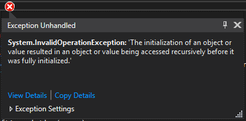
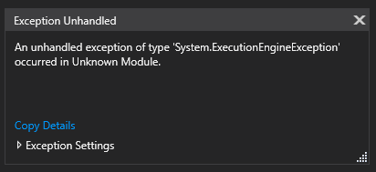
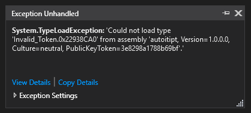

# Preamble

One should call this project _"AutoIt++ **Interpiler**"_, as it is an interpreter from a C#'s point of view - but works more like a compiler when viewing it from AutoIt's side....

It kind of interprets everything and transforms it into C# code, which then gets compiled. My component is therefore an interpreter - but the whole project is technically a compiler.

So we call it an **Interpiler** for now...

# The AutoIt++ ~Interpreter~ Interpiler

This project is an interpiler written to target a custom flavour of the _AutoIt3_ scripting language called _"AutoIt++"_ (even though it has nothing to do with C++).

The most important aspect of this project is the fact, that the interpiler is not only platform-independent, but can also cross-platform and cross-architecture target applications.

The interpiler can currently target the following systems (can be specified via the flag `-t`):
 - `win7`, `win8`, `win81`, `win10`
 - `centos`, `fedora`, `gentoo`, `opensuse`
 - `debian`, `ubuntu`, `linuxmint`
 - `osx`
 - `android` _comming soon_
 - and much more...
 
The following architectures are currently supported:
 - `x86`, `x64` (The 32Bit- and 64Bit-compatible systems from Intel or AMD)
 - `arm`, `arm64` (ARM's equivalent)

For more information about the usage of the interpiler, refer to the [usage page](doc/usage.md).

## Links

 - [Usage page](doc/usage.md)
 - [AutoIt++ Language reference](doc/language.md)
 - [AutoIt++ Syntax reference](doc/syntax.md)
 - [AutoIt++ Runtime behaviour](doc/runtime.md)
 - [AutoIt++ Syntax tree reference](doc/syntax-tree.md)
 - [Official AutoIt3 documentation](https://www.autoitscript.com/autoit3/docs/)
 - [The TODO list](todo.txt)

## Credits

This AutoIt++-interpiler is written in C# and F# targeting the .NET-Core Framework in order to provide full platform independency.

A big shoutout to the [Roslyn Dev Team](https://github.com/dotnet/roslyn) and the [.NET Core Dev Team](https://github.com/dotnet/coreclr) for making such an awesome framework possible!

It uses a modified version of the [_Piglet_-Library](https://github.com/Dervall/Piglet) written by [@Dervall](https://github.com/Dervall) in order to improve expression parsing.
All credits go to him for the wonderful LR-Parser-Library!!

## Maintainer(s)

 - [@Unknown6656](https://github.com/Unknown6656)
 - ([@Zedly](https://github.com/Zedly) in assistive and advisory function)

-----------------

_An historic image:_ 

_A not-so-historic image:_ 

_Don't change the code of anonymous, dynamic types during runtime debugging:_ 

